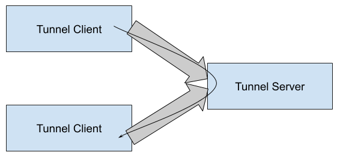
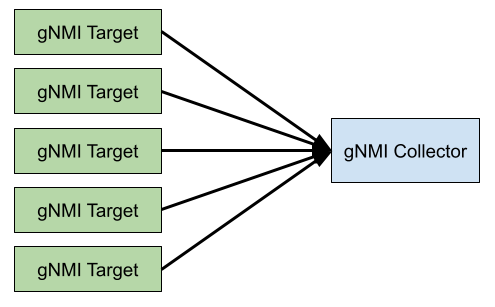
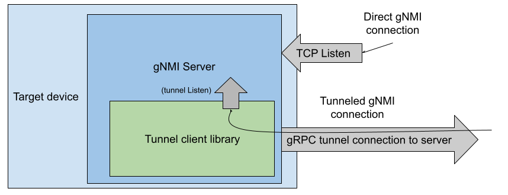
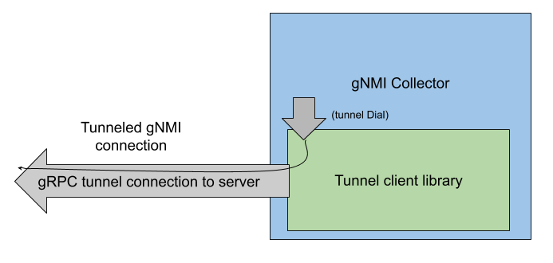
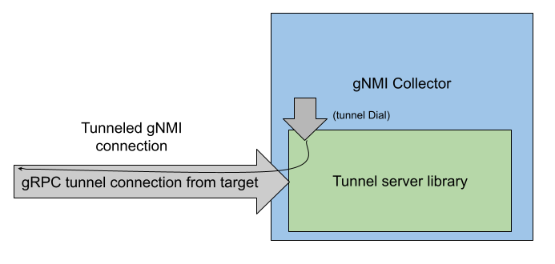

# gNMI/gNOI/ssh dial-out via grpctunnel

**Contributors**:
Carl Lebsack

- [gNMI/gNOI/ssh dial-out via grpctunnel](#gnmignoissh-dial-out-via-grpctunnel)
- [Introduction](#introduction)
- [Generic gRPC tunnel](#generic-grpc-tunnel)
  - [Tunnel establishment](#tunnel-establishment)
  - [Target registration](#target-registration)
  - [Tunnel session establishment](#tunnel-session-establishment)
    - [Tunnel server to tunnel client session establishment](#tunnel-server-to-tunnel-client-session-establishment)
    - [Tunnel client to tunnel server session establishment](#tunnel-client-to-tunnel-server-session-establishment)
    - [Tunnel client to tunnel client session establishment](#tunnel-client-to-tunnel-client-session-establishment)
  - [Target subscription](#target-subscription)
- [Select deployment use cases](#select-deployment-use-cases)
  - [Dial-out gNMI collector](#dial-out-gnmi-collector)
    - [Target-side gNMI tunnel client as a separate binary](#target-side-gnmi-tunnel-client-as-a-separate-binary)
    - [Target-side gNMI tunnel client embedded within a gNMI server](#target-side-gnmi-tunnel-client-embedded-within-a-gnmi-server)
    - [gNMI collector as a tunnel client with tunnel server as a separate binary](#gnmi-collector-as-a-tunnel-client-with-tunnel-server-as-a-separate-binary)
    - [gNMI collector with embedded tunnel server](#gnmi-collector-with-embedded-tunnel-server)
  - [SSH over tunnel](#ssh-over-tunnel)
    - [SSH local server connections redirected via a tunnel client](#ssh-local-server-connections-redirected-via-a-tunnel-client)
    - [SSH client dialing via a tunnel client](#ssh-client-dialing-via-a-tunnel-client)

# Introduction
There are several use cases that dictate the need to reverse the direction in which a TCP session is established between a client and server.  There was a [detailed discussion](https://docs.google.com/document/d/1R0o_ZFoeIUSXZ3LYEZcx-9AvyCpUfNMdiIpzh-Sb8G8) about many options on how to support this use case either for a specific RPC (e.g. gNMI.Subscribe) or more broadly for multiple distinct RPCs, services or protocols.  This document focuses on elaborating on the suggested deployment of a generic tunnel implemented over gRPC.  This document is meant to provide an overview of the [grpctunnel project](http://github.com/openconfig/grpctunnel) on github.  Presented below is an overview of the solution followed by several specific use cases to illustrate how they can leverage a common infrastructure API in various deployment scenarios.

# Generic gRPC tunnel
This section describes the generic tunnel API that can be used for various deployment options, some of which are enumerated in the subsequent section.  In all cases, there is a base level tunnel API that consists of at least one tunnel server and one or more tunnel clients.  Between each tunnel client and tunnel server there exists a single tunnel that is a single gRPC session.  Within the gRPC session there is a single persistent Register RPC that is a bidirectional stream that handles the registration of targets, subscription of targets

## Tunnel establishment
This is the process by which a tunnel client dials a tunnel server and invokes a persistent streaming grpctunnel.Register RPC to enable subsequent opening of one or more tunnel sessions by either the tunnel client or tunnel server and the optional registration of one or more targets also by either the tunnel client or tunnel server.

The tunnel server must be network reachable by the tunnel client, and both the tunnel client and tunnel server must be configured with mutually compatible authentication mechanisms.  This document does not aim to enumerate all mechanisms but for illustration, a given implementation should support both insecure TLS with no certificate verification and mTLS with bidirectional certificate verification.  The encryption and verification of the tunnel is completely independent of any encryption, authentication and authorization that happens over a session within the tunnel.

In practice, it is possible that a gNMI server could support both both dial-in and dial-out at the same time. It can accept connections via TCP over the tunnel, or accept connections via TCP over the local interface.

The requirement for encrypted transport (TLS or mTLS) implies that if a tunnel session carries a gNMI RPC or ssh there will be double encryption, once at the tunnel layer and a second at the gNMI API layer.  While it may be tempting to run the tunnel without encryption, doing so would eliminate the ability to perform authentication at the tunnel level, which is not recommended. Removing encryption at the API layer, such as gNMI or SSH, when carried over an encrypted tunnel is also not suggested as this breaks end-to-end authentication of the API client which is also not recommended. Without delving into a host of security concerns, we recommend that strong authentication and encryption be used both at the tunnel level and any API carried over the tunnel.

## Target registration
This is the mechanism of the gRPC tunnel that can be leveraged to communicate information about the types of targets supported by either end of the tunnel.  In this document, all use cases will assume that there is an explicit registration of available targets by at least one tunnel client or tunnel server, independent of requisition of sessions for those targets.  All established sessions of the tunnel are to reference registered targets. The same grpctunnel.Register RPC is used to exchange both target registrations and session establishment messages and differentiated by the Registration oneof in the RegisterOp message. Target registration uses the Target message in that oneof.

Target registration is the means by which one side of the tunnel advertises explicitly what is available for access by the other side.  Although a server can be configured to reject targets, the most common case is for it to accept at least some targets, potentially based on type.  For a tunnel client, it will only be sent targets if it specifically subscribes for them.  See subscriptions below.

For example, a tunnel client can convey to the tunnel server the unique name of an available target (target_id) and service for that target (target_type = “GNMI_GNOI”). Both target_id and target_type are strings to allow for the most flexible tunnel deployment options.  The inclusion of a TargetType enum in the tunnel.proto enables the standardization of a set of predefined protocols to be carried by the tunnel.  However, a protocol not included within the enum can still be used within the tunnel so long as the tunnel client and tunnel server agree on a common string for the type.

Specifically, the target_id is not prescribed, but should be unique in a given deployment. Some examples of what can be used for the target_id include hostname, chassis serial number or mac address, management IP address.  This target_id is assumed to be leveraged within gNMI as the [Path target field](https://github.com/openconfig/reference/blob/master/rpc/gnmi/gnmi-specification.md#2221-path-target) in the case the tunnel is hosting a gNMI interface and allows a tunnel server to redirect a gNMI request over the corresponding tunnel session. The value of this id is expected to be defined by a network operator and should be configurable on each target to be provided when dialing out to a tunnel server.

The target_type field, although flexible, is used in conjunction with target_id to differentiate among multiple protocols supported for the same target.  It is a string to allow for arbitrary TCP protocols to be supported over the tunnel.  However, standard protocols are explicitly included in the tunnel Protocol enum, (e.g. GNMI_GNOI, SSH), and the string value for that enumeration can be reliably used on both tunnel clients and tunnel servers.

The diagram below shows the call flow of the tunnel establishment. It uses a 
standalone tunnel server for the purpose of this illustration. Alternative deployments will be discussed in more detail in [Select deployment use cases](#select-deployment-use-cases). Here each network device (gNMI server or target device) will establish a gRPC tunnel with one or more tunnel servers by finishing the registration step. After that, the network devices will accept future connections over the created tunnels.

## Tunnel session establishment
Once a tunnel is established between a tunnel client and tunnel server, the persistent bidirectional Registration RPC can be used to request a new gRPC session be established between the tunnel client and tunnel server to carry an arbitrary TCP session. There are three different ways a session can be established which are enumerated below.  In all cases, the session is established only to targets previously registered on the tunnel server, either by the tunnel server itself, or by one of its tunnel clients.

### Tunnel server to tunnel client session establishment
This is the simplest case to understand in the context of the gRPC tunnel solution as it enables reversing the dial semantics of TCP to enable a connection from tunnel server to tunnel client when there may be no direct network reachability in that direction.  A tunnel client dials the tunnel server and registers one or more targets.  The tunnel server then requests a new session to one of those targets over the Register stream, which is then established as a new Session RPC from the respective tunnel client. Once established, the new Session RPC can be used to carry any TCP session between the tunnel client and tunnel server.

### Tunnel client to tunnel server session establishment
In this case, a target registered on the tunnel server can be contacted by a tunnel client.  This case may seem unnecessary as the tunnel client already has network reachability to the tunnel server to establish the tunnel, but there are reasons that connections in this direction over the tunnel may be desirable.  One such example is relying on the tunnel to authorize and authenticate connections, hiding available services from being publicly discoverable.

After a tunnel client establishes a tunnel session to the tunnel server, the tunnel client can notify the tunnel server that it wishes to be notified of available tunnel server targets.  The tunnel server can send a list of targets reachable behind it to the tunnel client.  The tunnel client can then request and start a session to one of those targets over the tunnel.  These services might be hosted on the tunnel server binary itself, or relayed to the ultimate service provider elsewhere either over a direct TCP dial (or by another tunnel connection, see Tunnel Client to Tunnel Client session establishment).

### Tunnel client to tunnel client session establishment
This final case is a special case of the tunnel client to tunnel server session establishment whereby the ultimate connection may be routed to another tunnel client.  It illustrates the full power of the gRPC tunnel in that a tunnel server can act as a midpoint for connections between tunnel clients.  A tunnel client can, in addition to or instead of registering its available targets, request to be notified of targets reachable by the tunnel server.  This special case focuses on the ability to route a single session be relayed by concatenating two independent tunnel client sessions within the tunnel server.

## Target subscription
A tunnel client has the option of getting a subscription of all targets registered with the tunnel.  After the Tunnel is established, a tunnel client sends a Subscribe message (optionally specifying a target type) and receives a stream of Target messages from the tunnel server for all currently registered targets followed by a Subscribe accept.  Future target additions that match the subscription type will be forwarded to the tunnel client as Target messages at the time they are added. A subscription is used by a client of the selected tunnelled protocol (e.g. an ssh client for ssh or a gNMI telemetry collector for a gNMI.Subscribe) to discover the list of targets reachable via a given tunnel server.

# Select deployment use cases
## Dial-out gNMI collector
In this example there are a group of gNMI target devices that are configured to initiate a tunnel connection to a common gNMI collector.  The collector does not know a priori which devices will be connected and will collect from all target devices that connect.

To implement the above, there are multiple options on both the device and collector side with how they integrate to the gRPC tunnel. Below will illustrate the variants on each side of the tunnel independently as they are interchangeable across the tunnel interface.

### Target-side gNMI tunnel client as a separate binary
This option is available to a target implementer that wants to leverage the tunnel implementation as provided in Go without the need to directly integrate the code into an existing gNMI server which might be implemented in another language. The existing gNMI Server can be run without modification.  The tunnel client can be launched as a separate binary that establishes a tunnel to a remote collector and forwards all gNMI requests over tunnel sessions to the running tunnel server via a local TCP connection between the two binaries.

The grpctunnel repository has an [example tunnel client application](https://github.com/openconfig/grpctunnel/blob/master/cmd/client/client.go) that can be configured to perform this task by connecting to a remote tunnel server and redirecting incoming sessions over a TCP connection dialed from the tunnel client to the local gNMI server.

### Target-side gNMI tunnel client embedded within a gNMI server
This option provides a means to deploy the tunnel client as a library within an application that hosts a gNMI server. In this example, a single binary acts as both the gNMI server and the tunnel client.  A tunnel listener is installed in parallel to the TCP listener in the gRPC service for gNMI.

### gNMI collector as a tunnel client with tunnel server as a separate binary
In this option, the gNMI Collector dials to the tunnel server to gain discovery and reachability access to targets connected to the tunnel server.  Subsequent gNMI Subscribe requests can be issued as connections over the tunnel to the targets as in the diagram above for Tunnel client to tunnel client session establishment.

### gNMI collector with embedded tunnel server
In this instance the gNMI collector binary also hosts the tunnel server directly, allowing targets to connect.  Upon tunnel establishment, the target registration can trigger the collector to issue gNMI.Subscribe calls back over the respective established tunnel.

## SSH over tunnel
### SSH local server connections redirected via a tunnel client
No modification is done for the local SSH server.  A tunnel client is configured to accept incoming connections for SSH and redirect over a local TCP dial.  The tunnel client can be either a standalone client or could be embedded in another binary, such as a gNMI server. The connection path looks like that for Target-side gNMI tunnel client as a separate binary, above.

### SSH client dialing via a tunnel client
SSH clients can dial to a target by proxying through a tunnel client to a tunnel server to connect to an ssh target which is connected to the same tunnel server via its own client. The ProxyCommand option can be used to establish a TCP connection between the ssh client and server over a tunnel session between the two.

`$ ssh -o ProxyCommand=”tunnel_client <TUNNEL_SERVER> -dial <TARGET_NAME> -type SSH”`
